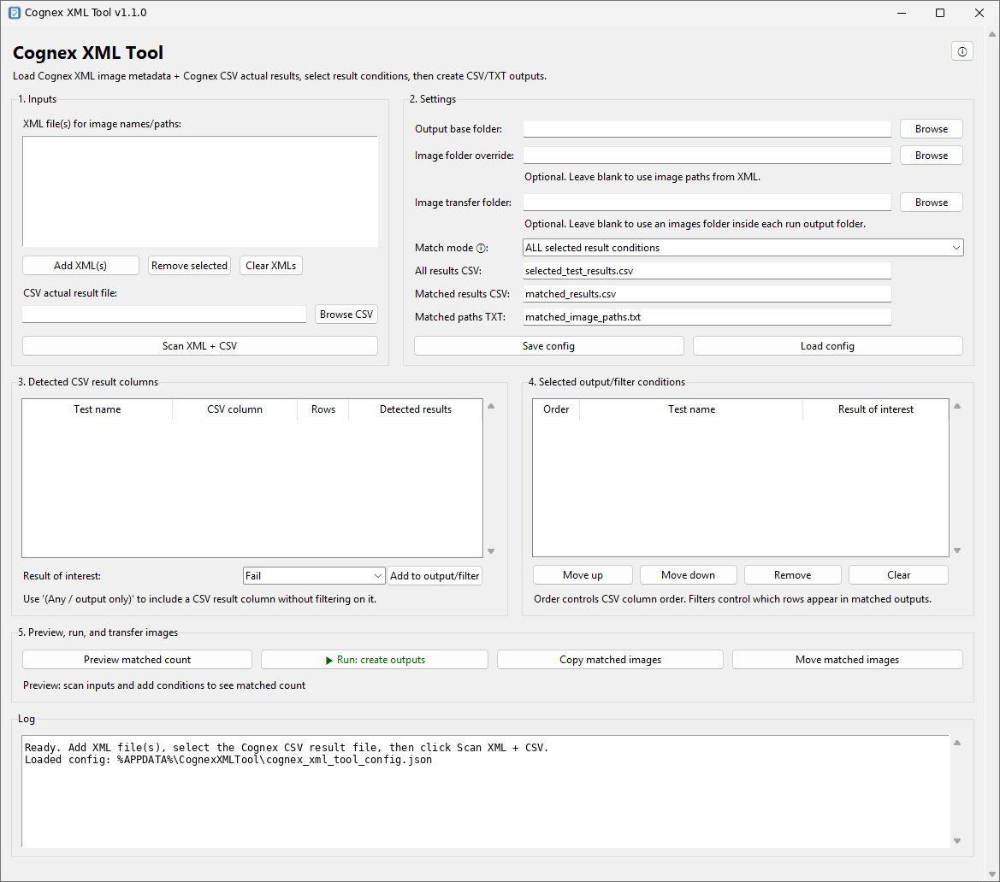

# Cognex XML Tool

**Version:** 1.1.0  
**Author:** Hemy Gulati  
**GitHub:** https://github.com/HemyGulati/CognexXMLTool  
**License:** MIT License

Cognex XML Tool is a Windows-friendly GUI for combining Cognex XML image metadata with Cognex CSV runtime result data.

The XML is used for image names, image paths, and image order. The CSV is used for the actual runtime inspection results.

## Screenshot




## Why this workflow exists

Some Cognex XML exports contain expected results rather than actual runtime results. For result review and image sorting, the more reliable workflow is:

```text
XML = image names / image paths / image order
CSV = actual runtime results
```

The tool merges both files internally, lets the user choose result conditions, previews the matched count, and creates filtered CSV/TXT outputs.

## Features

- Load one or more Cognex XML files.
- Load a Cognex CSV actual result file.
- Automatically detect CSV result columns such as:
  - `InspectionAPass`
  - `InspectionBPass`
  - `OverallPass`
- Convert common result values automatically:
  - `1`, `true`, `PASS`, `OK` → `Pass`
  - `0`, `false`, `FAIL`, `NG` → `Fail`
- Merge CSV rows to XML image names using:
  - an image name/path column if available, or
  - a `Record`/index column mapped to XML image order, or
  - CSV row order fallback.
- Select which result columns to include in the output.
- Choose result conditions such as `Pass`, `Fail`, or output-only.
- Reorder selected result columns before exporting.
- Preview matched image count before generating outputs.
- Generate:
  - `selected_test_results.csv`
  - `matched_results.csv`
  - `matched_image_paths.txt`
- Automatically creates a result-specific output folder for each run.
- Defaults the output base folder to the folder containing the selected CSV file.
- Names each run folder using the selected test names and result conditions.
- Defaults copied/moved images to an `images` folder inside the run output folder.
- Copy or move matched images directly from the GUI.
- Auto-save and auto-load the last used configuration.
- Uses a stable Windows config location instead of saving config beside the EXE.
- Includes an app icon for the GUI, About popup, EXE, Windows taskbar, and installer.
- Scrollable GUI layout for smaller screens.
- Build scripts included for creating a standalone Windows EXE and installer.

## Example output structure

If the selected CSV file is in:

```text
C:\Example\Cognex Runs\
```

and the selected conditions are:

```text
Inspection A = Pass
Inspection B = Fail
```

then the tool creates a folder like:

```text
C:\Example\Cognex Runs\Inspection_A_Pass_AND_Inspection_B_Fail\
```

Inside that folder, the tool creates:

```text
selected_test_results.csv
matched_results.csv
matched_image_paths.txt
images\
```

The `images` folder is used when the user clicks **Copy matched images** or **Move matched images**.

## Basic workflow

1. Open **Cognex XML Tool**.
2. Add the Cognex XML file that contains image names and image paths.
3. Select the Cognex CSV file that contains the actual result values.
4. The output base folder will default to the CSV file folder.
5. Click **Scan XML + CSV**.
6. Select a detected CSV result column.
7. Choose the result of interest, for example `Pass` or `Fail`.
8. Click **Add to output/filter**.
9. Repeat for any other tests/results of interest.
10. Click **Preview matched count** to check how many images match.
11. Click **Run: create outputs**.
12. Click **Copy matched images** or **Move matched images** if required.

## Config location

The app no longer saves the default config beside the EXE.

On Windows, the default config is saved here:

```text
%APPDATA%\CognexXMLTool\cognex_xml_tool_config.json
```

Example:

```text
C:\Users\<YourName>\AppData\Roaming\CognexXMLTool\cognex_xml_tool_config.json
```

This is intentional because installed applications normally live under `Program Files`, which standard users often cannot write to. Using `AppData` keeps the installer clean and prevents config files from appearing in random folders such as Downloads or the EXE build folder.

If an old config exists beside the EXE from an earlier portable build, the app will try to migrate it into the new AppData location automatically.

## Match modes

### ALL selected result conditions

The image must match every selected filter condition.

Example:

```text
Inspection A = Pass AND Inspection B = Fail
```

### ANY selected result condition

The image only needs to match one selected filter condition.

Example:

```text
Inspection A = Fail OR Inspection B = Fail OR Inspection C = Fail
```

## Output files

### selected_test_results.csv

Contains all merged image rows and the selected result columns.

### matched_results.csv

Contains only the image rows that match the selected result conditions.

### matched_image_paths.txt

Contains one image path per matched image. This can be used by the GUI copy/move buttons or by command-line tools.

## Build the Windows EXE

Install Python first, then run:

```bat
build_exe.bat
```

The executable will be created at:

```text
dist\Cognex XML Tool.exe
```

The build script uses PyInstaller and includes the app icon automatically.

## Build the Windows installer

The installer is built using **Inno Setup 6**.

1. Install Inno Setup 6 from the official Inno Setup website.
2. Run:

```bat
build_installer.bat
```

The script will:

1. Build the standalone EXE using PyInstaller.
2. Build the Windows installer using Inno Setup.

The installer will be created in:

```text
installer_output\
```

The installer installs the app to:

```text
C:\Program Files\Cognex XML Tool\
```

It also creates a Start Menu shortcut and can optionally create a Desktop shortcut.

## Run from Python

```bat
run_gui_from_python.bat
```

or:

```bat
python cognex_xml_tool.py
```

## Notes

This tool is intended for offline result analysis and image sorting from Cognex XML/CSV exports. It does not modify the Cognex job or communicate with the Cognex system.


## Windows taskbar icon

The packaged EXE uses the app icon through PyInstaller. The source also sets a Windows AppUserModelID so the taskbar icon is more reliable when running the app directly from Python.

## License

This project is released under the MIT License. See [`LICENSE`](LICENSE) for details.

## Installer troubleshooting

If `build_installer.bat` finds Inno Setup but no installer appears, scroll up in the terminal and check the compiler error. The installer output should be created in:

```text
installer_output\
```

The build script now creates that folder before running Inno Setup and passes the output folder directly to the compiler. The Inno Setup compiler is detected from common locations, including:

```text
%LocalAppData%\Programs\Inno Setup 6\ISCC.exe
```
